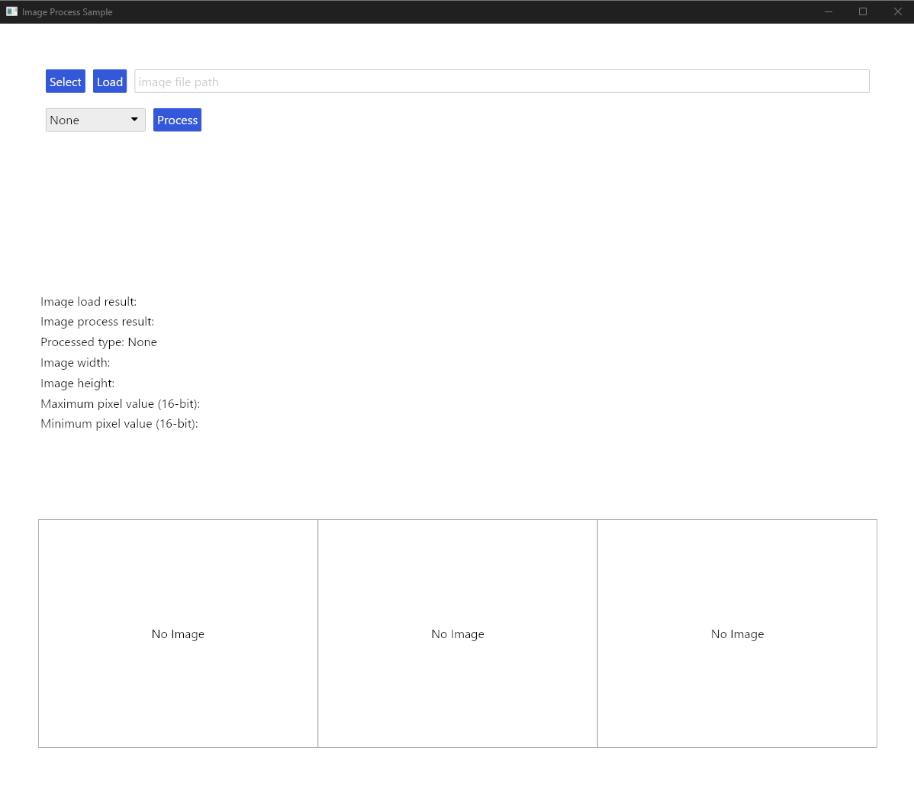

# Simple Image Processing Application

This is a simple image processing application for my understanding of Rust.



## Dependencies

- [iced](https://github.com/hecrj/iced)
- [rfd](https://github.com/PolyMeilex/rfd)
- [image](https://github.com/image-rs/image)

## Usage

To run the application, use the following command:

```bash
cargo run